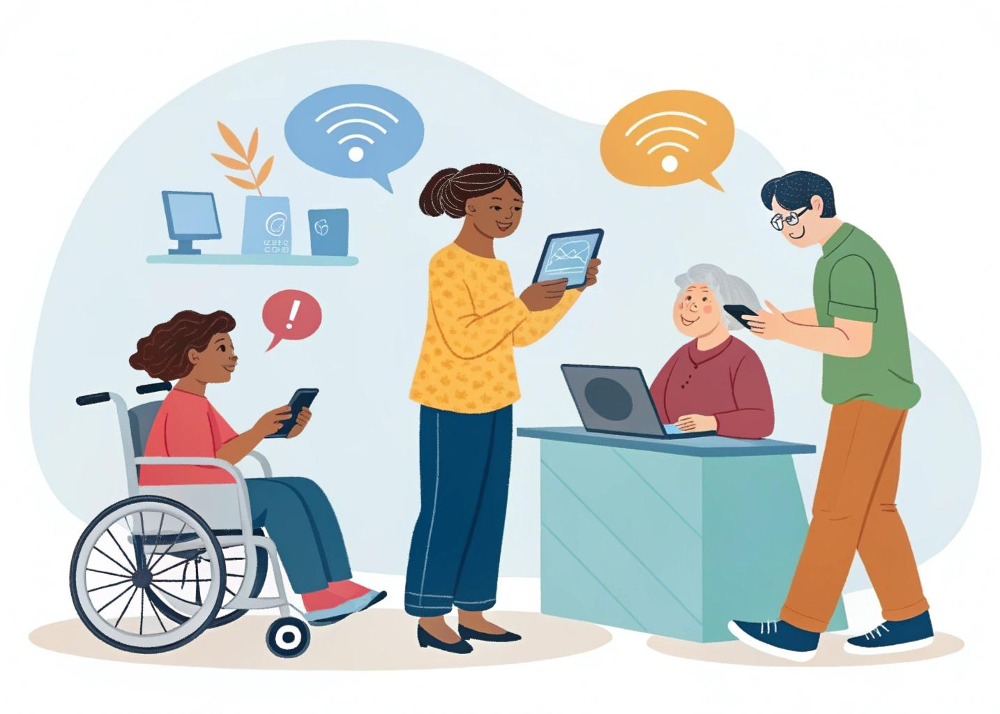

Syllabus “Knowledge Badge - European Accessibility Act (KB-EAA)”

*Version 1.1 vom 12.11.2025*

*Anmerkung: Die Version 1.1 ist eine leichte Veränderung der bereits beschlossenen Version 1.0. Änderungen:*

-   *Hinweis auf die Bedeutung der Länderkennungen (siehe Hinweis bei den Lernzielen).*
-   *Bezug zu IAAP aus dem Vorwort herausgenommen.*

# Vorwort

Dieser Syllabus möchte Ihnen einen Überblick über die Inhalte und Kompetenzen (Lernziele) geben, die zum Knowledge Badge “European Accessibility Act” (KB-EAA) gehören. Damit erfahren Sie, welche Kenntnisse und Fertigkeiten von Kandidatinnen und Kandidaten erwartet werden, die das KB-EAA des Vereins zur Förderung von Barrierefreiheit erwerben möchten. [Weitere Informationen zum Konzept der Knowledge Badges](https://iaap-dach.org/knowledge-badges.html).

Der Syllabus setzt sich aus den folgenden Informationen zusammen:

-   Gliederung des Lerninhalts (7 Module mit Untermodulen)
-   Lernziele, welche die zu erwerbenden Kompetenzen beschreiben. Hinweis: Länderkennzeichnungen dienen zur Zuordnung der Lernziele zu nationalen Unterschieden, nicht zur Ausgrenzung des Lerninhalts. Relevant für die Prüfung sind immer ALLE Lernziele, unabhängig davon, in welchem Land die Prüfung abgelegt wird.
-   Links zu Ressourcen pro Untermodul (als getaggte Linksammlungen im [TRAINomat des Kompetenzzentrums für digitale Barrierefreiheit](https://trainomat.bf-lernen.de/)).   
    **Achtung:** Die Ressourcen sind nur eine Empfehlung. Sie sind nicht als vollständig zur Vorbereitung auf die Examensfragen zu betrachten. Kursanbietende und Selbstlernende sollten ihre Inhalte auf Basis der Lernziele selbst zusammensuchen.

Der Syllabus kann als strukturelle Vorlage für Workshops und Lernkurse verwendet werden, die das Ziel haben, die Teilnehmenden auf das KB-EAA vorzubereiten. Der Gebrauch des Syllabus zum Selbststudium ist nur Personen zu empfehlen, die sich schon gut im Bereich digitaler Barrierefreiheit auskennen und in der Lage sind, sich selbst zu den Lernzielen relevante Ressourcen zu suchen.

**Hinweis:** Es wird ausdrücklich darauf hingewiesen, dass das KB-EAA keine verbindlichen rechtlichen Auskünfte gibt. Wenn Sie das suchen, wenden Sie sich bitte an eine professionelle Rechtsberatung.

Die Zielgruppen für das KB-EAA sind unter anderem:

-   Leitende Personen in Organisationen
-   Projekt- und Teamleitung
-   Produktmanagement
-   Qualitätsmanagement und Compliance
-   Beauftragte für Barrierefreiheit

An diesem Syllabus haben mitgearbeitet:

-   Sven Bittenbinder
-   Stefan Farnetani, CPACC
-   Nina Gerling, CPWA
-   Joschi Kuphal, CPWA + ADS
-   Birgit Peböck
-   Sonja Weckenmann, WAS
-   Gottfried Zimmermann, CPWA, IAAP D-A-CH Board
-   Zsófia Gugán, CPWA
-   Michael Düren, IAAP D-A-CH Board

## Hinweis zum Lernansatz

Dieser Syllabus vermittelt praxisnahes Wissen zur Umsetzung von Barrierefreiheit in Organisationen. Unser Ziel ist es, Personen zu befähigen, inklusive Organisationen zu gestalten. Dabei liegt unser Fokus auf dem sozialen Modell von Behinderung, das Barrieren in der Umwelt und nicht die individuellen Beeinträchtigungen als zentrale Herausforderung betrachtet.

Um jedoch den Einsatz assistiver Technologien, barrierefreies Design und verschiedene Unterstützungsstrategien besser zu verstehen, werden vor allem in Modul 1 verschiedene Beeinträchtigungen thematisiert. Dies dient ausschließlich der Sensibilisierung und Wissensvermittlung – keinesfalls sollen Menschen mit Beeinträchtigungen in Schubladen gesteckt oder stigmatisiert werden.

## Lizenzinformationen

Lizenzinformation für diesen Syllabus: [CC-BY 4.](https://creativecommons.org/licenses/by/4.0/deed.de)

# Modul 1: Behinderungen, Herausforderungen und Assistive Technologien

In diesem Modul geht es um die Grundlagen für digitale Barrierefreiheit und relevante Begriffe. Es geht außerdem um die Vielfalt von Bedürfnissen Nutzender, digitale Barrieren und die Möglichkeiten zur Überwindung dieser Barrieren durch assistive Technologien und Design für Alle.

**Ressourcen für Modul 1 (alle Untermodule):** [TRAINomat: Suche nach „(KB-EAA) 1](https://trainomat.bf-lernen.de/?q=&tags=(KB-EAA)+1)“

## 1.1 Grundlagen digitaler Barrierefreiheit

**Lernziele:**

1.  Sie kennen und verstehen die wesentlichen Begriffsbestimmungen rund um das Thema Digitale Barrierefreiheit.
2.  Sie kennen und verstehen die wichtigsten theoretischen Modelle von Behinderung.
3.  Sie kennen die wichtigsten demografischen Kennzahlen von Menschen mit Behinderungen weltweit, in der EU und im D-A-CH-Raum.
4.  Sie kennen und verstehen die Prinzipien von Universal Design.
5.  Sie kennen den Unterschied zwischen Design für Alle, Universal Design und barrierefreiem Design.

**Ressourcen:** [TRAINomat: Suche nach „(KB-EAA) 1.1“](https://trainomat.bf-lernen.de/?q=&tags=(KB-EAA)+1.1)

## 1.2 Vielfalt der Bedürfnisse von Nutzenden

**Lernziele:**

1.  Sie kennen und verstehen die Unterscheidung der Bedürfnisse gemäß den Gruppen von Nutzenden in EN 301 549 (Kapitel 4).
2.  Sie verstehen, mit welchen Barrieren Menschen mit Behinderungen im Alltag und bei der Nutzung von Technologien konfrontiert sind, und können diese benennen.
3.  Sie kennen die verschiedenen assistiven Technologien und Adaptionsstrategien für Menschen mit Behinderungen und verstehen ihre Funktionsweise.
4.  Sie verstehen die grundlegende Etikette für die Kommunikation mit Menschen mit Beeinträchtigungen und erkennen respektvolle Verhaltensweisen.

**Ressourcen:** [TRAINomat: Suche nach „(KB-EAA) 1.2“](https://trainomat.bf-lernen.de/?q=&tags=(KB-EAA)+1.2)

## 1.3 Vorteile von Design für Alle

**Lernziele:**

1.  Sie kennen die Vorteile von Design für Alle für Organisationen und Unternehmen.

**Ressourcen:** [TRAINomat: Suche nach „(KB-EAA) 1.3“](https://trainomat.bf-lernen.de/?q=&tags=(KB-EAA)+1.3)

# Modul 2: Gesetze, Standards und Normen

In diesem Modul geht es um den European Accessibility Act (EAA) und seine Einflüsse auf die nationalen Gesetzgebungen in Deutschland, Österreich und der Schweiz. Die EN 301 549 und EN 17161 sind zentrale Normen für die Umsetzung digitaler Barrierefreiheitsanforderungen.

**Ressourcen für Modul 2 (alle Untermodule):** [TRAINomat: Suche nach “(KB-EAA) 2”](https://trainomat.bf-lernen.de/?q=&tags=(KB-EAA)+2)

## 2.1 Der EAA und die Umsetzung in nationales Recht

**Lernziele:**

1.  Sie kennen die Behindertenrechtskonvention der Vereinten Nationen (UN-BRK) und verstehen ihre Bedeutung für den EAA.
2.  Sie verstehen die Zielsetzung und Bedeutung des EAA für Europa und darüber hinaus.
3.  Sie können die Wirtschaftsakteure identifizieren, die vom EAA betroffen sind.
4.  [Deutschland] Sie haben ein Verständnis, wie der EAA mit dem BFSG und der BFSGV in Deutschland in nationales Recht umgesetzt wird.
5.  [Deutschland] Sie verstehen, welche Rolle das Telekommunikationsgesetz (TKG) und der Medienstaatsvertrag (MStV) im Rahmen der Umsetzung des European Accessibility Act (EAA) in Deutschland spielen und wie sie sich vom Barrierefreiheitsstärkungsgesetz (BFSG) abgrenzen.
6.  [Österreich] Sie haben ein Verständnis, wie das BaFG den EAA in österreichisches Recht umsetzt.
7.  [Österreich] Sie verstehen, welche Rolle das Telekommunikationsgesetz (TKG 2021) und das Audiovisuelle Medien-Gesetz (AMD-G) im Rahmen der Umsetzung des European Accessibility Act (EAA) in Österreich spielen und wie sie sich vom Barrierefreiheitsgesetz (BaFG) abgrenzen.
8.  Sie wissen, in welchen Fällen der EAA keine Anwendung findet (z. B. hinsichtlich der Art von Produkten und Dienstleistungen, Unternehmensgröße, Übergangsfristen).
9.  [Schweiz] Sie haben ein Verständnis, welche Auswirkungen der EAA in der Schweiz hat.
10. [Deutschland, Österreich] Sie kennen die formalen Anforderungen an eine „Information zur Barrierefreiheit“ (EAA Artikel 13 und Anhang V, BFSG Anhang 3, BaFG Anlage 3)
11. [Deutschland, Österreich] Sie kennen den Unterschied zwischen der (a) „Erklärung zur Barrierefreiheit“ (WAD, BITV, WZG) und (b) der „Information zur Barrierefreiheit“ (EAA, BFSG, BFG).
12. Sie wissen, in welchen Fällen eine „Information zur Barrierefreiheit“ benötigt wird.

**Ressourcen:** [TRAINomat: Suche nach „(KB-EAA) 2.1“](https://trainomat.bf-lernen.de/?q=&tags=(KB-EAA)+2.1)

## 2.2 Normen und Standards

Das Modul behandelt den Zusammenhang zwischen Gesetzen und Normen/Standards, die zentralen europäischen Normen zur Barrierefreiheit im Kontext des EAA und deren Bedeutung für die nachhaltige Umsetzung im Unternehmen.

**Lernziele:**

1.  Sie kennen den Zusammenhang zwischen Normen/Standards und Gesetzen.
2.  Sie verstehen die Bedeutung harmonisierter Normen.
3.  Sie kennen die EN 301 549 mit ihren Gruppen von Nutzenden (Kap. 4).
4.  Sie kennen die EN 301 549 mit ihren technischen Prüfkriterien (ab Kap. 5).
5.  Sie kennen den Zusammenhang zwischen EN 301 549 und WCAG 2.
6.  Sie haben ein Verständnis und Bewusstsein für die Bedeutung, Barrierefreiheit nachhaltig im Unternehmen zu verankern und wissen, wie die EN 17161 dabei unterstützt.
7.  Sie kennen die „funktionalen Leistungskriterien“ und wissen, unter welchen Bedingungen sie angewandt werden.

**Ressourcen:** [TRAINomat: Suche nach „(KB-EAA) 2.2“](https://trainomat.bf-lernen.de/?q=&tags=(KB-EAA)+2.2)

## 2.3 Pflichten der Wirtschaftsakteure

**Lernziele:**

1.  Sie kennen die Pflichten der Herstellenden, Importierenden und Handelnden von Produkten, die in den Anwendungsbereich des EAA fallen.
2.  Sie haben ein Verständnis davon, was ein Konformitätsbewertungsverfahren ist und welche erfüllten Pflichten damit von Herstellenden sichergestellt werden müssen.
3.  Sie kennen die besonderen Kennzeichnungs- und Informationspflichten der Herstellenden.
4.  Sie wissen, welche Informationen zum Produkt bereitgestellt werden müssen.
5.  Sie kennen die Anforderungen, wie die Informationen zum Produkt bereitgestellt werden müssen.
6.  Sie kennen die Pflichten der Dienstleistenden, die in den Anwendungsbereich des EAA fallen.
7.  Sie wissen, welche Informationen von Dienstleistenden bereitgestellt werden müssen und in welcher Weise dies geschehen muss.

**Ressourcen:** [TRAINomat: Suche nach „(KB-EAA) 2.3“](https://trainomat.bf-lernen.de/?q=&tags=(KB-EAA)+2.3)

## 2.4 Marktüberwachung

**Lernziele:**

1.  Sie haben ein Verständnis für die Aufgaben und Vorgehensweisen der Marktüberwachung.
2.  Sie kennen die Maßnahmen (Sanktionen), die der Marktüberwachung bei Nicht-Konformität zur Verfügung stehen.
3.  [Deutschland, Österreich] Sie wissen, wer für die Marktüberwachung in Deutschland und Österreich zuständig ist.

**Ressourcen:** [TRAINomat: Suche nach „(KB-EAA) 2.4“](https://trainomat.bf-lernen.de/?q=&tags=(KB-EAA)+2.4)

## 2.5 Rechte von Verbraucherinnen und Verbrauchern

**Lernziele:**

-   Sie kennen die Rechte von Verbraucherinnen und Verbrauchern bei Nicht-Konformität von Produkten und Dienstleistungen gemäß EAA und wissen, an welche Stellen sie sich wenden können.

**Ressourcen:** [TRAINomat: Suche nach „(KB-EAA) 2.5“](https://trainomat.bf-lernen.de/?q=&tags=(KB-EAA)+2.5)

# Modul 3: Produkte

Der EAA unterscheidet zwischen Produkten und Dienstleistungen. Die vom EAA definierten Produktkategorien werden in Modul 3 behandelt.

Ressourcen für

**Ressourcen für Modul 3 (alle Untermodule):** [TRAINomat: Suche nach „(KB-EAA) 3“](https://trainomat.bf-lernen.de/?q=&tags=(KB-EAA)+3)

## 3.1 Hardwaresysteme für Universalrechner inklusive Betriebssysteme

**Lernziele:**

1.  Sie kennen die Definition eines Universalrechners.
2.  Sie kennen die allgemeinen und besonderen Anforderungen an die Barrierefreiheit von Hardwaresystemen und Betriebssystemen von Universalrechnern (EAA Anhang I).

**Ressourcen:** [TRAINomat: Suche nach „(KB-EAA) 3.1“](https://trainomat.bf-lernen.de/?q=&tags=(KB-EAA)+3.1)

## 3.2 Zahlungsterminals

**Lernziele:**

1.  Sie kennen die Definition von Zahlungsterminals.
2.  Sie kennen die allgemeinen und besonderen Anforderungen an die Barrierefreiheit von Zahlungsterminals (EAA Anhang I).

**Ressourcen:** [TRAINomat: Suche nach „(KB-EAA) 3.2“](https://trainomat.bf-lernen.de/?q=&tags=(KB-EAA)+3.2)

## 3.3 Selbstbedienungsterminals (im Zusammenhang mit den von der Richtlinie erfassten Dienstleistungen)

**Lernziele:**

1.  Sie kennen die Definition von Selbstbedienungsterminals.
2.  Sie kennen die allgemeinen und besonderen Anforderungen an die Barrierefreiheit von Selbstbedienungsterminals (EAA Anhang I).
3.  Sie kennen relevante Beispiele für Selbstbedienungsterminals (im Zusammenhang mit den von der Richtlinie erfassten Dienstleistungen).

**Ressourcen:** [TRAINomat: Suche nach „(KB-EAA) 3.3“](https://trainomat.bf-lernen.de/?q=&tags=(KB-EAA)+3.3)

## 3.4 Interaktive Verbraucherendgeräte für Telekommunikationsdienste

**Lernziele:**

1.  Sie kennen die Definition von interaktiven Verbraucherendgeräten für Telekommunikationsdienste.
2.  Sie kennen die allgemeinen und besonderen Anforderungen an die Barrierefreiheit von interaktiven Verbraucherendgeräten für Telekommunikationsdiensten (EAA Anhang I).
3.  Sie kennen relevante Beispiele für interaktive Verbraucherendgeräte für Telekommunikationsdienste.
4.  Sie verstehen die Bedeutung von „Text in Echtzeit“ (Real-Time-Text) in Verbindung mit Sprach- und Video-Kommunikation.
5.  [Deutschland, Österreich] Sie wissen, dass es auch in anderen Gesetzen Vorgaben zur Barrierefreiheit von interaktiven Verbraucherendgeräten für Telekommunikationsdienste gibt (TKG, TKG 2021).

**Ressourcen:** [TRAINomat: Suche nach „(KB-EAA) 3.4“](https://trainomat.bf-lernen.de/?q=&tags=(KB-EAA)+3.4)

## 3.5 Interaktive Verbraucherendgeräte für audiovisuelle Mediendienste

**Lernziele:**

1.  Sie kennen die Definition von interaktiven Verbraucherendgeräten für audiovisuelle Mediendienste.
2.  Sie kennen die allgemeinen und besonderen Anforderungen an die Barrierefreiheit von interaktiven Verbraucherendgeräten für audiovisuelle Mediendienste (EAA Anhang I).
3.  Sie kennen relevante Beispiele für interaktive Verbraucherendgeräte für audiovisuelle Mediendienste.
4.  [Deutschland, Österreich] Sie wissen, dass es auch in anderen Gesetzen Vorgaben zur Barrierefreiheit von interaktiven Verbraucherendgeräten für audiovisuelle Mediendienste gibt (MStV, AMD-G).

**Ressourcen:** [TRAINomat: Suche nach „(KB-EAA) 3.5“](https://trainomat.bf-lernen.de/?q=&tags=(KB-EAA)+3.5)

## 3.6 E-Book-Lesegeräte

**Lernziele:**

1.  Sie kennen die Definition von E-Book-Lesegeräten.
2.  Sie kennen allgemeine und besondere Anforderungen an die Barrierefreiheit von E-Book-Lesegeräten (EAA Anhang I).

**Ressourcen:** [TRAINomat: Suche nach „(KB-EAA) 3.6“](https://trainomat.bf-lernen.de/?q=&tags=(KB-EAA)+3.6)

# Modul 4: Dienstleistungen

Der EAA unterscheidet zwischen Produkten und Dienstleistungen. Die vom EAA definierten Dienstleistungskategorien und ihre Unterstützungsdienste werden in Modul 4 behandelt.

**Ressourcen:** [TRAINomat: Suche nach „(KB-EAA) 4“](https://trainomat.bf-lernen.de/?q=&tags=(KB-EAA)+4)

## 4.1 Elektronischer Geschäftsverkehr

**Lernziele:**

1.  Sie wissen, was „Dienstleistungen im elektronischen Geschäftsverkehr“ im Kontext des EAAs sind.
2.  Sie verstehen die allgemeinen und besonderen Barrierefreiheitsanforderungen für Dienstleistungen im elektronischen Geschäftsverkehr und Unterstützungsdienste sowie die dazu relevanten Kommunikationskanäle (EAA Anhang I).
3.  Sie verstehen die Relevanz und Bedeutung der Barrierefreiheit von E-Commerce-Plattformen und Unterstützungsdienste, einschließlich Nachbetreuung und Kundenkommunikation.

**Ressourcen:** [TRAINomat: Suche nach „(KB-EAA) 4.1“](https://trainomat.bf-lernen.de/?q=&tags=(KB-EAA)+4.1)

## 4.2 Telekommunikationsdienste

**Lernziele:**

1.  Sie wissen, was „Telekommunikationsdienste“ im Kontext des EAAs sind.
2.  Sie kennen relevante Beispiele für Telekommunikationsdienste.
3.  Sie verstehen die allgemeinen und besonderen Barrierefreiheitsanforderungen für Telekommunikationsdienste (EAA Anhang I).
4.  Sie verstehen das Prinzip von “Total Conversation”.

**Ressourcen:** [TRAINomat: Suche nach „(KB-EAA) 4.2“](https://trainomat.bf-lernen.de/?q=&tags=(KB-EAA)+4.2)

## 4.3 Elemente von Personenbeförderungsdiensten

**Lernziele:**

1.  Sie wissen, was „Personenbeförderungsdienste“ im Kontext des EAAs sind.
2.  Sie kennen relevante Beispiele für Personenbeförderungsdienste.
3.  Sie verstehen die allgemeinen und besonderen Barrierefreiheitsanforderungen für Personenbeförderungsdienste (EAA Anhang I).

**Ressourcen:** [TRAINomat: Suche nach „(KB-EAA) 4.3“](https://trainomat.bf-lernen.de/?q=&tags=(KB-EAA)+4.3)

## 4.4. Bankdienstleistungen

**Lernziele:**

1.  Sie wissen, was „Bankdienstleistungen für Verbraucherinnen und Verbraucher“ im Kontext des EAAs sind.
2.  Sie kennen relevante Beispiele für Bankdienstleistungen für Verbraucherinnen und Verbraucher.
3.  Sie verstehen die allgemeinen und besonderen Barrierefreiheitsanforderungen für Bankdienstleistungen für Verbraucherinnen und Verbraucher (EAA Anhang I).

**Ressourcen:** [TRAINomat: Suche nach „(KB-EAA) 4.4“](https://trainomat.bf-lernen.de/?q=&tags=(KB-EAA)+4.4)

## 4.5 Dienstleistungen für den Zugang zu audiovisuellen Mediendiensten

**Lernziele:**

1.  Sie wissen, was „audiovisuelle Mediendienste“ im Kontext des EAAs sind.
2.  Sie kennen relevante Beispiele für audiovisuelle Mediendienste.
3.  Sie verstehen die allgemeinen und besonderen Barrierefreiheitsanforderungen für audiovisuelle Mediendienste (EAA Anhang I).

**Ressourcen:** [TRAINomat: Suche nach „(KB-EAA) 4.5“](https://trainomat.bf-lernen.de/?q=&tags=(KB-EAA)+4.5)

## 4.6 E-Books

**Lernziele:**

1.  Sie wissen, was E-Books im Kontext des EAAs sind.
2.  Sie kennen relevante Formate für E-Books.
3.  Sie verstehen die allgemeinen und besonderen Barrierefreiheitsanforderungen für E-Books (EAA Anhang I).
4.  Sie kennen die Anforderungen für EPUB Accessibility.

**Ressourcen:** [TRAINomat: Suche nach „(KB-EAA) 4.6“](https://trainomat.bf-lernen.de/?q=&tags=(KB-EAA)+4.6)

## 4.7 Unterstützungsdienste

**Lernziele:**

1.  Sie wissen, was Unterstützungsdienste im Kontext des EAAs sind.
2.  Sie kennen die Anforderungen an Unterstützungsdienste.

**Ressourcen:** [TRAINomat: Suche nach „(KB-EAA) 4.7“](https://trainomat.bf-lernen.de/?q=&tags=(KB-EAA)+4.7)

# Modul 5: Ergänzende Anforderungen an Dokumente und Videos

Dokumente und Videos können vom EAA betroffen sein, wenn sie im Zusammenhang mit E-Commerce oder anderen relevanten Dienstleistungen stehen. Dieses Modul gibt einen Überblick über PDF-, Word- und InDesign-Dokumente sowie Videos.

**Ressourcen:** [TRAINomat: Suche nach „(KB-EAA) 5“](https://trainomat.bf-lernen.de/?q=&tags=(KB-EAA)+5)

## 5.1 PDF-Dokumente

**Lernziele:**

1.  Sie kennen den aktuell anwendbaren PDF/UA-Standard.
2.  Sie kennen die Beziehung zwischen dem PDF-Standard und dem PDF/UA-Standard.
3.  Sie kennen die wichtigsten Merkmale von PDF-Dokumenten, die sie barrierefrei machen.
4.  Sie kennen den Unterschied zwischen automatisch überprüfbaren und von Menschen zu überprüfenden Kriterien auf Basis des Matterhorn-Protokolls bzw. “Well-Tagged PDF”.

**Ressourcen:** [TRAINomat: Suche nach „(KB-EAA) 5.1“](https://trainomat.bf-lernen.de/?q=&tags=(KB-EAA)+5.1)

## 5.2 Word-Dokumente

**Lernziele:**

1.  Sie kennen die wichtigsten Merkmale von Word-Dokumenten, die sie barrierefrei machen.
2.  Sie kennen die automatische Barrierefreiheitsprüfung in Word und können ihre Ausgaben interpretieren.
3.  Sie wissen um die Grenzen von Word beim Export in andere barrierefreie Formate, wie z. B. PDF oder EPUB.

**Ressourcen:** [TRAINomat: Suche nach „(KB-EAA) 5.2“](https://trainomat.bf-lernen.de/?q=&tags=(KB-EAA)+5.2)

## 5.3 InDesign-Dokumente

**Lernziele:**

1.  Sie wissen, in welchen Fällen InDesign das richtige Werkzeug zur Erstellung von barrierefreien Dokumenten ist.
2.  Sie kennen die wichtigsten Merkmale von InDesign-Dokumenten, die sie barrierefrei machen.
3.  Sie wissen um die Grenzen von InDesign beim Export in andere barrierefreie Formate, wie z. B. PDF.

**Ressourcen:** [TRAINomat: Suche nach „(KB-EAA) 5.3“](https://trainomat.bf-lernen.de/?q=&tags=(KB-EAA)+5.3)

## 5.4 Videos

**Lernziele:**

1.  Sie kennen die wichtigsten Kriterien für barrierefreie Videos im Web und in mobilen Anwendungen.
2.  Sie wissen, welche dieser Kriterien in der EN 301 549 vorgeschrieben sind.

**Ressourcen:** [TRAINomat: Suche nach „(KB-EAA) 5.4“](https://trainomat.bf-lernen.de/?q=&tags=(KB-EAA)+5.4)

# Modul 6: Testmethodik und Testwerkzeuge

Die EN 301 549 gibt die Prüfkriterien zur Konformität nach dem EAA vor. Man unterscheidet zwischen automatischem Testen und manuellem Testen. Testmethodiken sind standardisierte Prüfverfahren, die auf Prüfkriterien aufbauen.

**Ressourcen:** [TRAINomat: Suche nach „(KB-EAA) 6“](https://trainomat.bf-lernen.de/?q=&tags=(KB-EAA)+6)

## 6.1 Testkriterien der Barrierefreiheit

**Lernziele:**

1.  Sie kennen und verstehen das Prinzip der Konformität nach EN 301 549.
2.  Sie wissen um den Bezug zwischen EN 301 549 und WCAG 2.
3.  Sie kennen den kontextspezifischen Charakter der Anforderungen der EN 301 549 (“self scoping”).
4.  Sie kennen die Anforderungen der EN 301 549 und sind in der Lage, diese den Benutzergruppen anhand Anhang B zuzuordnen.

**Ressourcen:** [TRAINomat: Suche nach „(KB-EAA) 6.1“](https://trainomat.bf-lernen.de/?q=&tags=(KB-EAA)+6.1)

## 6.2 Automatisches Testen

**Lernziele:**

1.  Sie verstehen das Prinzip von automatisierten Tests für Websites, mobile Anwendungen und Dokumente.
2.  Sie kennen die Stärken und Grenzen von automatisierten Testwerkzeugen.
3.  Sie verstehen, wie automatisierte Testwerkzeuge in verschiedenen Phasen des Entwicklungsprozesses (z. B. Entwurf, Entwicklung, Test) genutzt werden können.

**Ressourcen:** [TRAINomat: Suche nach „(KB-EAA) 6.2“](https://trainomat.bf-lernen.de/?q=&tags=(KB-EAA)+6.2)

## 6.3 Manuelles Testen

**Lernziele:**

1.  Sie verstehen das Prinzip von manuellen Tests für Websites, mobile Anwendungen und Dokumente (z. B. Stichprobenbildung, Qualitätssicherung).
2.  Sie kennen die Stärken und Grenzen von manuellen Tests.
3.  Sie kennen die Bedeutung der Einbeziehung von Menschen mit unterschiedlichen Einschränkungen in den Prozess der manuellen Prüfung.

**Ressourcen:** [TRAINomat: Suche nach „(KB-EAA) 6.3“](https://trainomat.bf-lernen.de/?q=&tags=(KB-EAA)+6.3)

## 6.4 Testmethodiken

**Lernziele:**

1.  Sie kennen Prüfverfahren für Websites, Apps und Dokumente, unter Berücksichtigung der besonderen Anforderungen für E-Commerce-Systeme und andere Systeme zur Unterstützung von Dienstleistungen.
2.  Sie kennen die Website Accessibility Conformance Evaluation Methodology (WCAG-EM).
3.  Sie kennen die Testverfahren von BIT Inklusiv (für Software, mobile Apps, PDF).
4.  Sie kennen das BIK BITV-Testverfahren (für Websites, mobile Apps).

**Ressourcen:** [TRAINomat: Suche nach „(KB-EAA) 6.4“](https://trainomat.bf-lernen.de/?q=&tags=(KB-EAA)+6.4)

# Modul 7: Barrierefreie Organisationen und Prozesse

Barrierefreiheit sollte in Unternehmen strategisch verankert, systematisch geplant und kontinuierlich weiterentwickelt werden. Eine klare Ausrichtung im Leitbild bildet dafür die Grundlage. Entscheidend sind gezielte Maßnahmen, um Barrierefreiheit praktisch zu gestalten, Zuständigkeiten zu definieren und Ressourcen bedarfsgerecht einzusetzen.

## 7.1 Leitbild und Unternehmensgrundsätze

**Lernziele:**

1.  Sie verstehen, warum es wichtig ist, Inklusion und Barrierefreiheit in Leitbild und Strategie des Unternehmens zu verankern.
2.  Sie wissen, welche Informationen hilfreich sind, um Gespräche mit Interessensgruppen über digitale Barrierefreiheit zu führen.
3.  Sie wissen, wie Sie organisationsweite Unterstützung für digitale Barrierefreiheit aufbauen und fördern können.

**Ressourcen:** [TRAINomat: Suche nach „(KB-EAA) 7.1](https://trainomat.bf-lernen.de/?q=&tags=(KB-EAA)+7.1)[“](https://trainomat.bf-lernen.de/?q=&tags=(KB-EAA)+7.1)

## 7.2 Verantwortlichkeiten und Strukturen

**Lernziele:**

1.  Sie wissen um die Bedeutung eines interdisziplinären Inklusions- oder Diversitätsgremiums, z. B. bestehend aus Personal, IT, Facility Management und Betriebsrat, inkl. Personen mit Beeinträchtigungen.
2.  Sie kennen die verschiedenen Rollen in Organisationen und wissen, welche Kompetenzen sie für die Umsetzung digitaler Barrierefreiheit benötigen.

**Ressourcen:** [TRAINomat: Suche nach „(KB-EAA) 7.2“](https://trainomat.bf-lernen.de/?q=&tags=(KB-EAA)+7.2)

## 7.3 Verbindliche Prozesse und Richtlinien

**Lernziele:**

1.  Sie wissen, wie man Barrierefreiheit als kontinuierlichen Prozess etabliert und durch Richtlinien absichert.
2.  Sie können Maßnahmen zur Qualitätssicherung und Erfolgskontrolle benennen, zum Beispiel mit regelmäßigen Überprüfungen, Audits und Befragungen bei der Kundschaft zum Stand der Barrierefreiheit.
3.  Sie haben ein Verständnis dafür, wie sich Änderungen in Standards und rechtlichen Vorgaben zur digitalen Barrierefreiheit auf bestehende Prozesse und Richtlinien auswirken und wie diese angepasst werden können.
4.  Sie wissen um die Bedeutung eines kontinuierlichen Verbesserungsprozesses, zum Beispiel mit regelmäßigen Auswertungen von Support-Anfragen, Problemmeldungen oder Feedback-Systemen.

**Ressourcen:** [TRAINomat: Suche nach „(KB-EAA) 7.3“](https://trainomat.bf-lernen.de/?q=&tags=(KB-EAA)+7.3)

## 7.4 Sensibilisierung und Schulungen

**Lernziele:**

1.  Sie wissen, wie Sie Ziele und Nutzen digitaler Barrierefreiheit zielgruppengerecht und regelmäßig in der Organisation kommunizieren und dadurch das Verständnis und die Motivation für barrierefreies Handeln stärken.
2.  Sie kennen die Bedeutung von regelmäßigen zielgruppenspezifischen Schulungsmaßnahmen.
3.  Sie haben ein Verständnis dafür, wie sich Änderungen in Standards und rechtlichen Vorgaben zur digitalen Barrierefreiheit auf bestehende Maßnahmen zur Sensibilisierung und Schulung auswirken und wie diese angepasst werden können.

**Ressourcen:** [TRAINomat: Suche nach „(KB-EAA) 7.4“](https://trainomat.bf-lernen.de/?q=&tags=(KB-EAA)+7.4)

## 7.5 Weiterentwicklung, Reifegradmodelle

**Lernziele:**

1.  Sie wissen, wie man klare und realistische Ziele zur Förderung und Weiterentwicklung der digitalen Barrierefreiheit und relevanter Prozesse formuliert.
2.  Sie haben ein Verständnis, welche Vorteile die Einbindung von Menschen mit Einschränkungen in Entwicklungs- und Entscheidungsprozesse bringt.
3.  Sie verstehen, was ein Reifegradmodell ist und wozu man es verwendet.

**Ressourcen:** [TRAINomat: Suche nach „(KB-EAA) 7.5“](https://trainomat.bf-lernen.de/?q=&tags=(KB-EAA)+7.5)

# Anhang (informativ): KI-generierte Illustrationen zu den Modulen

Diese Bilder dürfen frei verwendet werden. Bitte darauf achten, dass die Alternativtexte mit kopiert werden.

## Illustration zu Modul 1

## Illustration zu Modul 2

![Mit [Recraft AI] erzeugtes Bild, basierend auf dem Prompt: Minimal flat illustration showing European Accessibility Act (EAA) documents with EU flag. Clean, modern, presentation-friendly style.](media/b6ef113000f0fcf0d513b727a5867b23.png)

## Illustration zu Modul 3

![Mit [Recraft AI] erzeugtes Bild, basierend auf dem Prompt: Flat illustration of accessible digital products: payment terminal, and e-book reader. Clean, modern, presentation-friendly style.](media/dab6a96b8cee014ff6bcd5f6ed9b48d9.jpg)

## Illustration zu Modul 4

![Mit [Recraft AI] erzeugtes Bild, basierend auf dem Prompt: Flat illustration of a woman in a wheelchair using her smartphone to operate an accessible ATM. Clean, modern, presentation-friendly style.](media/de872ac2bdc98752651cf8e2c433ee40.jpg)

## Illustration zu Modul 5

![Mit [Recraft AI] erzeugtes Bild, basierend auf dem Prompt: Flat illustration of a person using a screen reader on a computer with documents (PDF, Word) and videos. Icons for captions, audio, and accessibility features included. Clean, modern, presentation-friendly style.](media/80894d253963b5a7f9ff31d021ba9f40.jpg)

## Illustration zu Modul 6

![Mit [Recraft AI] erzeugtes Bild, basierend auf dem Prompt: Flat illustration of a person checking digital accessibility on a computer with testing tools, showing automatic and manual testing icons. Clean, modern, presentation-friendly style.](media/e7546adf5729ae319951b074b2b0b318.jpg)

## Illustration zu Modul 7

![Mit [Recraft AI] erzeugtes Bild, basierend auf dem Prompt: Flat illustration of a team in an office planning and implementing accessibility initiatives, with icons for accessible documents, digital tools, and inclusive processes. Clean, modern, presentation-friendly style.](media/ce473d69cff4f57dc41ee2dea4d0e371.jpg)
